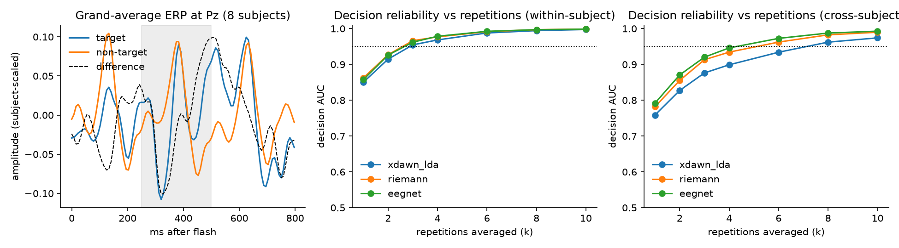

# p300-erp-detection

[](https://github.com/ankanbiswas022/p300-erp-detection/actions/workflows/ci.yml)


**Single-trial P300 detection on a public speller dataset, and how many repetitions a
decision needs.** Three detectors (xDAWN + LDA, Riemannian tangent space, EEGNet) under
one interface, evaluated within-subject and cross-subject, plus a decision-level
aggregation curve: the number that a P300-based product actually cares about.

<p align="center"></p>

## Results

RESULTS_TABLE

Per-subject means over 8 subjects, single-trial AUC. Target : non-target ratio is 1 : 5, so
average precision (AP) is reported alongside AUC. Full per-subject numbers in
[reports/metrics.json](reports/metrics.json).

**Decision-level reliability.** Averaging the detector's score over k repeated
presentations of the same item:

AGG_TABLE

This is the curve that sets a product's session length: with a calibrated detector, a few
repetitions are enough for a decision AUC above 0.95; without calibration, more are needed.

## Why these three models

| | xDAWN + LDA | Riemannian (xDAWN cov → tangent space → logreg) | EEGNet |
|---|---|---|---|
| Idea | supervised spatial filters that maximise the evoked response, then a linear classifier on the filtered epoch | covariance of [evoked prototype ; epoch] mapped to a Euclidean tangent space; geometry handles scale/impedance differences | learned temporal + depthwise spatial filters |
| Calibration data needed | a few hundred trials | a few hundred trials | thousands |
| Cross-subject robustness | moderate | best in most benchmarks | fragile on small cohorts |
| Cost | ms | ms | seconds to train, ms to run |

## Validation regimes

* **Within-subject** (stratified 5-fold per subject): performance after a short calibration
  session for that person. This is how P300 spellers and concealed-information tests are
  deployed.
* **Cross-subject** (leave-one-subject-out): zero-calibration performance.
* **Aggregation curve**: draw k target and k non-target trials of the same subject, average
  the scores, and measure the AUC of the aggregated decision as k grows (400 draws per k).

## Quick start

```bash
pip install --index-url https://download.pytorch.org/whl/cpu torch && pip install -e ".[dev]"
pytest -q                          # synthetic-ERP tests, no download
python -m p300erp.run --prepare    # downloads BNCI 2014-008 via MOABB (~100 MB), runs everything
```

## Data

BNCI 2014-008 (Riccio et al. 2013, *Frontiers in Human Neuroscience*): 8 participants with
ALS, 8-channel EEG (Fz, Cz, Pz, Oz, P3, P4, PO7, PO8), 256 Hz, row/column P300 speller, 10
repetitions per character, 4200 stimulus-locked trials per subject. Accessed through
[MOABB](https://moabb.neurotechx.com/). Here: resampled to 128 Hz, 1–24 Hz band-pass,
0–0.8 s post-stimulus.

## Author

Ankan Biswas — PhD (Neuroscience), IISc Bengaluru. ankanbiswas0804@gmail.com ·
[eeg-cognitive-scoring](https://github.com/ankanbiswas022/eeg-cognitive-scoring) ·
[Google Scholar](https://scholar.google.com/citations?user=oG28KRIAAAAJ) ·
[LinkedIn](https://www.linkedin.com/in/ankan-biswas-45357685/)
